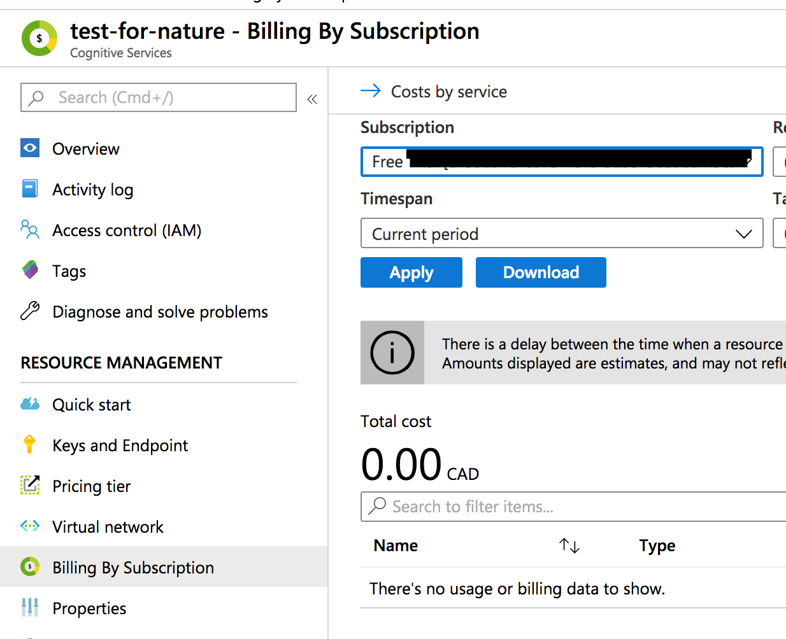

## Overview 

Digital images of archival materials are plentiful; no doubt, on your own computer or camera you have dozens of photographs of historical handwritten documents. The [Tropy](https://tropy.org) research photo management app is an excellent tool or imposing some order on such collections, and for transcribing or otherwise taking notes on the images.

Transcription however takes a lot of time. Computer vision coupled with machine learning gives us a short-cut.

In this lesson, you will use the Microsoft Azure 'Cognitive Services' API to identify and retrieve text from handwritten documents. Then, with some regular expressions to get this material into shape, we will use a small Ruby script to turn these results into a jsonld file that can be imported into Tropy, and thus copy your results into the 'Notes' pane for each individual image in your collection.

## Requirements

- Download [Tropy](https://tropy.org)
- Python 3. While Python 2.7 is installed on Mac machines by default, Windows users will need to install it. I recommend downloading and installing [Anaconda](https://www.anaconda.com/distribution/) with Python 3.7 for both Mac and Windows users.
- Ruby. Ruby is preinstalled on Macs. For Windows, you can get Ruby from [RubyInstaller](https://rubyinstaller.org/).
- [Sublime Text](https://www.sublimetext.com/) or another editor that allows you to use regular expressions or 'regex' to find and replace. (Nb. Regular expressions can have subtle differences in how they are implemented in different tools. The regex described below have been tested on Sublime Text. 


## Computer Vision

In recent years, computer vision technologies have been improving in leaps and bounds. There are a couple of approaches to teaching the computer to 'see' objects or things of interest in our photographs. The literature is voluminous, so I'm just going to give you the 30 second elevator pitch version.

With **supervised learning** we carefully mark up an image with bounding boxes (squares) and manually tag each box with labels describing what's in the box. The computer learns to associate patterns of pixels in the box with the relevant label. We can get a little bit less strict by collecting thousands of images where the thing-of-interest is the main thing in the picture - a cropped pic of a kitten - and then exposing the image to a **neural network**.

A neural network is a bit like a series of connected filters. Each filter is set up to allow different sized particles pass through the mesh to the next layer. Except, in our case, each 'filter' is a mathematical function that responds to the presence or absence of data in a limited area of the image. If there is data, it 'fires' and the *next* layer responds to whether or not it received data from the previous layer. We progress through the layers, and at the end of it, we have a pattern of lit-up neurons that represents the visual imagery data. If we expose the network to a picture of a kitten, we take the resulting pattern as indicative of 'kittenosity'. Then when the network encounters a new picture - say one of those little dogs that fit in a purse - it will light up in a subtley different way, enabling us to say, 'this picture is only 65% likely to be a kitten'.

So - in the first approach, a kitten is either in the picture, or it is not. In the second approach, we can get degrees of fuzziness of whether or not a picture contains a kitten. This is important, because it enables the machine to make guesses.


A visualization of how a neural network 'sees'. By [Alex Mordvintsev](https://twitter.com/zzznah/status/1118917356430995456). This is an animated gif; if it's not animating, click on it to see the full visual or go through the link to the original post on Twitter."


## Optical Character Recognition (OCR)

The [history of optical character recognition](https://en.wikipedia.org/wiki/Optical_character_recognition) is fascinating, and you could do worse than starting with the Wikipedia to learn more about it. It is in fact quite an old digital technology, and initially at least worked by pattern matching, one letter at a time, one font at a time. [This lesson on using Tessearct](https://programminghistorian.org/en/lessons/working-with-batches-of-pdf-files)shows you how to use [Tesseract](https://tesseract-ocr.github.io/) to identify and extract text from pdf files It works reasonably well on _typewritten_ materials, and this is no accident. A lot of the early business cases for OCR came out of eg legal firms that needed to make a lot of cleanly-written text available electronically. (Incidentally, this also accounts for why digital newspaper searches are rather dodgy, see [Milligan 2012 Illusionary Order: Cautionary Notes for Online Newspapers](http://activehistory.ca/2012/03/illusionary-order/)).

But what about handwriting? Handwriting is enormously personal. How can we possibly get a machine to do it? The [Transkribus project](https://transkribus.eu/Transkribus/) has produced a platform that allows you to import handwritten documents and carefully mark up the lines of text with your own expert transcription so that the computer learns to 'read' the material! As more people use the system, the system learns more handwriting variants from across the ages - medieval Latin, Arabic; other kinds of writing systems, other eras. 

But for us, there are some problems. Transkribus depends on having an awful lot of carefully, expertly, transcribed data before it can be trained. 

## A shortcut

Another option is to use a pretrained model and someone else's computing power to recognize and extract the handwritten text in our documents. In this case, we can take an image, feed it into the Microsoft Azure platform, and get the result back virtually instantaneously.

Warning:
I do not know on what data Microsoft trained its model. Nor do I know whether or not Azure uses user submitted data (images for processing) in its own training iterations. This is something we need to explore and understand.


### Part one: Getting Signed up with Azure.

1. Sign up for Microsoft [Azure](https://azure.microsoft.com/en-ca/free/). The link goes to the 'free' usage tier. **It will require a credit card for verification** but nothing we're doing should incur a cost.
2. Once you've jumped through all of those hoops **and you're signed in**, go to [portal.azure.com](http://portal.azure.com). It will look like this: 


The Azure portal. Under 'recent resources - name' yours will only say 'Free Tier' for now."

3. We're now going to create a 'service' that will allow us to feed images to their machine and get text back. You will want to click on 'cognitive services'.
4. Click on 'add new resource': 


Click the 'add' button, which will take you to the 'marketplace'."

5. You will then search the market place for 'computer vision'; select 'computer vision' and on the next screen hit 'create': 


This is the one you want.


Hit the 'create' button.

6. Fill in this form as I've done below. **Make sure 'subscription' says 'Free Trial' and under the 'Pricing Tier' drop down arrow select F0**. 


Crucial: Subscription should be 'Free Trial' and Pricing tier should be 'FO'.

7. Now, you have access to this service from your [portal](http://portal.azure.com) (where it will be listed under 'recent resources'). The service when you're on it looks like this: 


Mine is called 'test-for-nature'.

The crucial information we will need is the 'key' and the 'endpoint'. The key allows us to identify ourselves to Microsoft, so that their computers know that we have permission to ask the machine to do something (and also, who to bill). Never share your key or expose it in eg a screenshot. The 'endpoint' is our door into their computers. Copy the key and the endpoint into a text file on your computer where you can find it later. Note also you can check your pricing tier and any costs you encurred by clicking on the relevant menu items: 


Here we have the free tier enabled.


and so far it hasn't costed me anything.


### Part Two: Writing a Command to Extract Handwriting

I will first walk through how to use the Azure SDK to transcribe a single image. All of this code is also available in a virtual computer made available to us via Google's 'Colab' platform. Go to [this code notebook](https://colab.research.google.com/drive/1GnlIYzQp5IaCIfKaIFPfoY5G9btlX-Ht) and read through it carefully, following all instructions.

You _can_ download that notebook as an .ipynb file, which you could then open via Anaconda (open Anaconda, install then launch 'jupyter notebooks', and then in the notebook interface navigate to the file you downloaded and run it). 

#### Building an image recognition script

First, we need to install some bits and pieces. At the terminal in Mac or via Anaconda's powershell for windows, we will first create an 'environment' for our image recognition work (Python uses lots of different lego bricks, as it were, and by creating an environment and putting the bricks inside it, we make sure that we don't create conflicts with other uses to which we might want to put these bricks).

`$ conda create --name vision python=3.7`

Press 'Y' at subsequent prompts. We now have an environment called 'vision' for our image recognition work.

Activate the environment:

`$ conda activate vision`

Now let's install the Azure materials we'll need:

`$ pip install --upgrade azure-cognitiveservices-vision-computervision`

And then also we might need to install PIL:

`$ pip install pillow`

In Sublime text, start a new file. Our code is built on [this code snippet from Azure](https://github.com/Azure-Samples/cognitive-services-quickstart-code/blob/master/python/ComputerVision/ComputerVisionQuickstart.py)

We'll start by declaring all of the bits and pieces that we are going to use.

```
#!/usr/bin/env python

from azure.cognitiveservices.vision.computervision import ComputerVisionClient
from azure.cognitiveservices.vision.computervision.models import TextOperationStatusCodes
from azure.cognitiveservices.vision.computervision.models import TextRecognitionMode
from azure.cognitiveservices.vision.computervision.models import VisualFeatureTypes
from msrest.authentication import CognitiveServicesCredentials

from array import array
import os
from PIL import Image
import sys
import time
```

Next, we'll provide our credentials for using Azure. You will need your key and endpoint from when you signed up for Azure. Replace xxxx with the key, and yyyy with the endpoint (which begins with https). These values got _between_ the single quotes.

```
# credentials go here
os.environ['COMPUTER_VISION_SUBSCRIPTION_KEY']='xxxx'
os.environ['COMPUTER_VISION_ENDPOINT']='yyyy'

# Add your Computer Vision subscription key to your environment variables.
# These 'if-then' statements give us some error checking

if 'COMPUTER_VISION_SUBSCRIPTION_KEY' in os.environ:
    subscription_key = os.environ['COMPUTER_VISION_SUBSCRIPTION_KEY']
else:
    print("\nSet the COMPUTER_VISION_SUBSCRIPTION_KEY environment variable.\n**Restart your shell or IDE for changes to take effect.**")
    sys.exit()
# Add your Computer Vision endpoint to your environment variables.
if 'COMPUTER_VISION_ENDPOINT' in os.environ:
    endpoint = os.environ['COMPUTER_VISION_ENDPOINT']
else:
    print("\nSet the COMPUTER_VISION_ENDPOINT environment variable.\n**Restart your shell or IDE for changes to take effect.**")
    sys.exit()
```

Now the fun begins; we're going to point this script at a file I have online, a record card from the excavations of Fort Frontenac in Kingston Ontario by the Catarqui Archaeological Foundation, now held by the Museum of History in Gatineau (used with permission). You could use your own image; just uploaded it somewhere, right-click and 'copy image location' and then put between the quotations in the line below:

```
remote_image_url = "https://raw.githubusercontent.com/shawngraham/demo/master/frontenac-card.png"

print("===== Batch Read File - remote =====")
# Get an image with printed text
remote_image_printed_text_url = remote_image_url

# Call API with URL and raw response (allows you to get the operation location)
recognize_printed_results = computervision_client.batch_read_file(remote_image_printed_text_url,  raw=True)
```

Having retrieved the image, we'll pass the image over to Azure and retrieve the text:

``` 
# Get the operation location (URL with an ID at the end) from the response
operation_location_remote = recognize_printed_results.headers["Operation-Location"]
# Grab the ID from the URL
operation_id = operation_location_remote.split("/")[-1]

# Call the "GET" API and wait for it to retrieve the results 
while True:
    get_printed_text_results = computervision_client.get_read_operation_result(operation_id)
    if get_printed_text_results.status not in ['NotStarted', 'Running']:
        break
    time.sleep(1)

# Print the detected text, line by line
if get_printed_text_results.status == TextOperationStatusCodes.succeeded:
    for text_result in get_printed_text_results.recognition_results:
        for line in text_result.lines:
            print(line.text)
            #print(line.bounding_box)
print()

```

Save this file as `azure-demo.py`. In your terminal or powershell navigate to where this file is located, and run it: 

`$ python azure-demo.py`

The program grabs the image, sends it to Azure, and prints the response to the terminal! If you wanted to print the response to file, you would do this: 

`$ python azure-demo.py > output.txt`

### Part Three: Running the script on a batch of files 

The point of this lesson is not to teach you how to iterate over a batch of files to achieve something; but, in case you want to see how that works, we modify the script above so that instead of passing one image, we grab everything from a folder. It looks like this:

```Python 
   computervision_client = ComputerVisionClient(endpoint, CognitiveServicesCredentials(subscription_key))


    for image in os.listdir(directory_of_images):

        image_name = os.fsdecode(image)

        for suffix in image_filetypes:
            if (image_name.endswith(suffix)):
                '''
                Extracts handwritten text in an image, then print results, line by line.
                '''
                print("===== Processed Image - '" + image_name + "' =====")
                image_output_writer.writerow(["===== Processed Image - '" + image_name + "' ====="])
                # Get an image with printed text
                local_image = open(directory_of_images_filepath + image_name, 'rb')

                recognize_printed_results = computervision_client.batch_read_file_in_stream(local_image, raw=True)

                # Get the operation location (URL with an ID at the end) from the response
                operation_location_remote = recognize_printed_results.headers["Operation-Location"]
                # Grab the ID from the URL
                operation_id = operation_location_remote.split("/")[-1]

                # Call the "GET" API and wait for it to retrieve the results
                while True:
                    get_printed_text_results = computervision_client.get_read_operation_result(operation_id)
                    if get_printed_text_results.status not in ['NotStarted', 'Running']:
                        break

                # Print the detected text, line by line
                if get_printed_text_results.status == TextOperationStatusCodes.succeeded:
                    for text_result in get_printed_text_results.recognition_results:
                        for line in text_result.lines:
                            print(line.text)
                            image_output_writer.writerow([line.text])
                            #print(line.bounding_box)
                print()
                break
            else:
                continue
```

You can use our file [`handwriting.py`](handwriting.py) that will do this; right-click on the link and 'save as'.  

Have this file in a directory with the images you want to work on in a subfolder, arranged like so:

```
|
|-handwriting.py
|
|-images-subfolder
```

Run the command with `$ python handwriting.py`. It will ask you a few prompts. Responses are case-sensitive: 

`Would you like to use the default settings? (Y is just for dev testing) Y/N:` 

Respond: N

`Please enter the directory path:`

Respond: images-subfolder/ 

Note that trailing /. Don't forget it!

`Please enter a image type to search for (.png, .jpg, etc.):`

Respond with whatever the file extension is appropriate. Note that this is case sensitive! If your files are .JPG, then `.jpg` as your response will not work.

`Would you like to add another file type to search for? Y/N:`

Respond with Y or N as appropriate. If you select Y, it will ask you again about the image type.

`Specify a name for the output file:`

Respond with the name you'd like; the script will append the file extension.

`Would like to specify a directory path for the output .csv file? Otherwise, the file will be created in the same directory as this script. Y/N:`

Respond appropriately.

And the script will then pass your images over to Azure, writing the results to the terminal window and to file.

### Part Four Importing your results into Trophy 

If you open your output, you'll now find something like this:

```
===== Processed Image - 'e000000425.jpg' =====
and liecoke a piece out bullies )
cellar this d
raid fatigue parties were set to
dig dong-out for me siders which
wire to be bound proof. bible
===== Processed Image - 'e000000424.jpg' =====
over our carufs - and were marked
by huge black crosses while ours
```

We want to transform that file to look like this:

```
title: "This is the title",
path: "/Users/username/folder/a.png",
note: "Azure-recognized text goes here"
title: "This is another title"
path: "/Users/username/folder/b.png"
note: "Azure-recognized text goes here"
```

We will use [Regular Expressions](https://en.wikipedia.org/wiki/Regular_expression) to do this; you might find this lesson on [understanding regular expressions](https://programminghistorian.org/en/lessons/understanding-regular-expressions) helpful to review.

**Make a copy of your output; do the next step on the copy**. When regular expressions go wrong, it can be difficult to undo. Work on the copy. Open your copy of your output file in Sublime Text. First thing we'll do is remove any extraneous double or single quotes in the text:

+ find: `"`
+ replace:  

That is, have the replace field empty.

+ find: `'`
+ replace: 


Now turn on the regular expression button in your 'find' bar, which looks like a `.*`.

We'll put everything onto one line by looking for the _end_ of each line with `$` and the new line character `\n`:

+ find: `$\n`
+ replace: ` `    

That is, replace with a single space.

Now, go find the path to your images, and copy that. In my case, it's `/Users/shawngraham/Desktop/proghist-handwriting/gamble` . We're going to remove the 'processed image' marker, and replace it with the path to our file. We are also going to insert a quotation mark to indicate the _end_ of the previous image's transcribed text:

+ find: `(===== Processed Image - )(.+?)( =====)`
+ replace: `" \n /Users/shawngraham/Desktop/proghist-handwriting/gamble/\2 ~`

Here, we're defining _groups_ of patterns that we want to look for. The `.+?` means match as few characters as possible here between the first group and the third group . Putting a quote and a newline at the start of this marks off the end of the previous image's text, and then the path to the file replaces the 'Processed Image' text, while the `\2` puts that group _back_ into the replacement text, followed by a `~` character to mark where the text begins.

We want to move the note text underneath the path to our image. We'll do that like this:

+ find: `~`
+ replace: `\n note: "`

The new line character gets inserted, the `note: "` gets put in front of our transcribed text.

Now let's add the `path :"` key to our materials. Note the start of your path; in my case it's `/Users`; yours might be different, so modify the first group in the find text below as appropriate.

+ find: `(/Users)(.+?)(.jpg)`
+ replace: `path: "\1\2\3"`

This wraps your path inside quotation marks and puts `path :` in front of it.

We're at the last step, where we find the image filename, and put it into `title: ""`. We know the filename ends with .jpg, and it starts after the `/`, but we're going to use groups so that we insert it back where we need it. The first group finds the quote at the end of the note and the new line, then the subsequent groups find all of the elements of the path. 

+ find: `(" \n)(.+?)(.+/)(.+)(.jpg)`
+ replace: `\1 title: "\3" \n \2\3\4\5`

The `.+?` means match as few characters as possible here between the first group and the second group. 

Some whitespace has crept into our file at the start of some of the lines. We'll search for that, and replace it with nothing.

find: `^\s+`    
replace: ``

The `\s` indicates whitespace, while the `+` indicates 'one or more' of these.

There's now a blank line at the top of the file; delete that and save this file! On my machine, I called this file 'input.txt' in anticipation of the next bit.

### Part Five Import Into Tropy 

Start up Tropy; open an existing project or start a new one.

Drag and drop the images you are working with into Tropy.

We're going to take the file we just created, and turn it into a jsonld formatted file that Tropy will be able to parse, attaching the correct transcribed text to those images you just loaded.

This final script you'll use is written in Ruby. Let's build it. Start a new Sublime Text document.

The first part creates a template for the jsonld file:

```Ruby
#!/usr/bin/env ruby

require 'json'

input = ARGV[0]
items = []

def create_item(title)
  {
    'template' => 'https://tropy.org/v1/templates/generic',
    'http://purl.org/dc/elements/1.1/title' => title,
    'photo' => [{
      'template' => 'https://tropy.org/v1/templates/photo',
      'mimetype' => 'unknown',
      'checksum' => 'unknown',
      'http://purl.org/dc/elements/1.1/title' => title,
      'note' => [{
        'html' => {
        }
      }]
    }]
  }
end

```

This next bit opens the file we're transforming, and looks for those key:value pairs we just added via our regular expressions.

```Ruby
File.open input do |f|
  item = nil

  f.each do |line|
    key, value = line.split(':')
    value = JSON.parse(value.strip.delete_suffix(',')) unless value.nil?

    case key
    when 'title'
      items << item unless item.nil?
      item = create_item(value)
    when 'path'
      item['photo'][0]['path'] = value
    when 'note'
      item['photo'][0]['note'][0]['html']['@value'] = value
    end
  end

  items << item unless item.nil?
end
```

This final line writes all of the data according to the template, and writes it to file.

```Ruby
puts JSON.pretty_generate({ '@graph' => items }, indent: '  ')
```

Save this file as `convert.rb`. Our version is [here](convert.rb).

At the command line, 

`$ ruby convert.rb input.txt > output.json`

Drag and drop the `output.json` onto your Tropy project. There will be a slight pause, and then the appropriate text will appear in the notes pane for each note!

This [ruby script is orginally by Sylvester Keil](https://gist.github.com/inukshuk/3340397a1789d5c44358daeae5f55d47), a developer at Tropy and whose help is gratefully acknowledged!

### Conclusion

You now have a script for automatically extracting handwritten text from images. The quality of that text depends on the quality of the original images. The regex is not easy, but once you get the hang of it, very fast. The final script enables you to associate the transcribed text with the correct image in your image research management tool. 

### Going further 

Tropy has a plugin that allows export of images and metadata - including notes - to Omeka. I can imaging having an instance of Omeka with the Scripto crowd-sourced transcription plugin installed. You could 'seed' this instance with the automatically transcribed text using the workflow described in this lesson. A new user to your site would never be confronted with a blank text box, but instead the less-daunting task of correcting a more-or-less finished text!

We have a more complicated script for interacting with Azure [here](https://github.com/AehLane/Handwriting-Parsing-App) that will output the text in a few different formats, depending on where else you might like to use.


